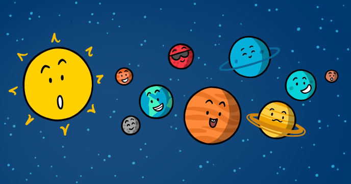

Learn how to create a simulation of our solar system with realistic planet movement. This educational application teaches you not only science concepts but also important coding concepts such as:

-	How to use objects to store complex data structures
-	How to use trigonometric functions
-	How to create animations using the loop event
 
## Source code 
The JavaScript source code of this program can be found [here](sketches/program.js). To run it, you need to import it in the [codeguppy.com](https://codeguppy.com) online editor. Alternatively, you can use the source code in your p5.js sketches (advanced use). 
## Online version 
To see the code running, check the online playground at [https://codeguppy.com/code.html?t=planets](https://codeguppy.com/code.html?t=planets) 
## Next steps 
Please check [codeguppy.com](https://codeguppy.com) for many other fun JavaScript programs and games for beginners. To stay up to date with CodeGuppy development please follow [@codeguppy](https://twitter.com/codeguppy) on Twitter.  
